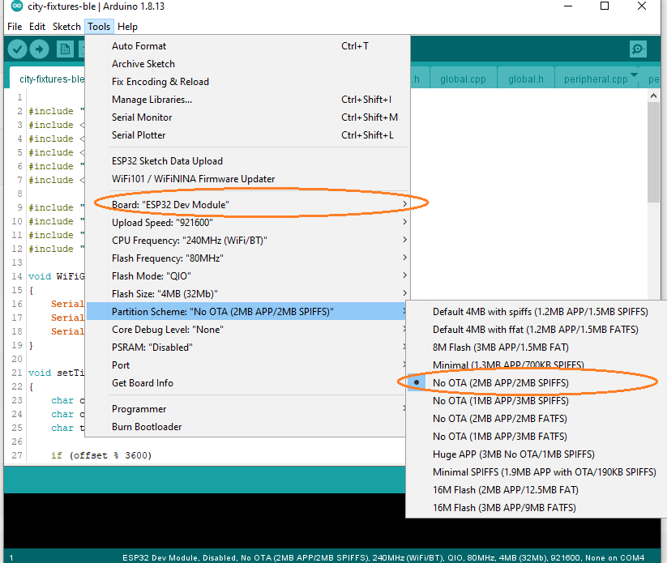
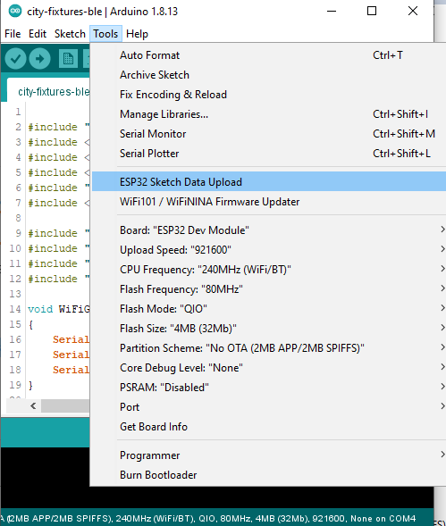

# city-fixtures-ble

    Control an elevator floor selection panel with an app and BLE.
    The hardware should put out a BLE peripheral that will allow a user to select a floor.

## Components

- Controller (ESP32)
- Relay Module
- Mobile Application

## Functionalities

_The controller should be able to be setup as “Elevator” or “Floor”_

### Elevator

- Set the number of floors (A-Z,0-1), Map each floor to a relay number (1-N) (this can be done via a config file)
- Set the name of the elevator
- Push the name of the elevator and available floors via BLE

### Floor

- Map the Up relay and the down relay, or just one of the 2
- Set the name of the floor
- Push the name of the Floor and available options

### BLE Service & Characteristics

- BLE device name: default `Fixture` able to change via characteristic

- Fixture BLE Service: ```0f7e0001-3e26-454e-9669-1a8b67b52161```

- Configuration characteristic: `0f7e0003-b5a3-f393-e0a9-e50e24dcca9e`

    - read

        *We could read current configuration setting for unit*

        example read value: when device has configured as floor and has 2 counts of relays.

        ```
        {
            "name": "Fixture",
            "mode": 0,
            "relay_count": 2,
            "relays": [
                {
                    "desc": "floorA",
                    "channel": 0
                },
                {
                    "desc": "floorZ",
                    "channel": 1
                }
            ]
        }        
        ```        

        **name**: *BLE advertising device name* 

        **mode**: *Fixture configuration type*

            0: Floor  
            1: Elevator  

        **relay_count**: *Relay count managing in unit*

            Default 2 for Floor , Default 8 for Elevator  

        **relays**: *Array of relays*

            desc: Description for relay such as "A-Z" or "1-16"
            channel: Relay layout number on device, for Floor 1 / 2, for Elevator 8 / 16 / 32.   

    - read

        *We could modify current configuration setting for unit*

        example write value: 
        ```
        {
            "name": "Fixture",
            "mode": 0,
            "relay_count": 2,
            "relays": [
                {
                    "desc": "A",
                    "channel": 0
                },
                {
                    "desc": "B",
                    "channel": 1
                }
            ]
        }        
        ```        
        _Write value could have one or more fields such as **name**, **mode**, **relay_count**, **relays**_

- Force realy characteristic: `0f7e0004-b5a3-f393-e0a9-e50e24dcca9e"`

    - write

        *We could force single or multiple relays via this characteristic*

        example write value:
        ```
        [
            {
                "desc": "floorA",
                "command": "on"
            },
            {
                "desc": "floorB",
                "command": "off"
            },
            ... 
            {
                "desc": "floorF",
                "command": "off"
            }
        ]
        ```


- Peripheral charateristic: `0f7e0002-b5a3-f393-e0a9-e50e24dcca9e`
    
    - notify
        
        *Every 1sec, it notifies current status of relays as json array*

        *example notify value: if floor module has 2 counts of relay and 1st relay is turned on, 2nd relay is turned off*
        ```
        1,0, 
        ```

- Systemtime characteristic: `0d7e0006-b5a3-f393-e0a9-e50e24dcca9e`
    - notify
        
        *Every 5sec, it will notify system date & time*

        example notify value:
        ```
        2020-09-01T09:08
        ```

    - write

        *You could change system date & time by writing value for this characteristic*

        example write value:
        ```
        2020-09-01T09:08
        ```

## ESP32 Firmware

### Dev environment
- Arduino IDE 1.8.12 or later 
- ESP32 arduino core latest stable version 

    https://github.com/espressif/arduino-esp32/blob/master/docs/arduino-ide/boards_manager.md

- Install arduino plugin to install html data to SPIFFS of ESP32

    https://github.com/me-no-dev/arduino-esp32fs-plugin 

### Additional libraries
- ArduinoJson
    
    https://github.com/bblanchon/ArduinoJson

### Compilation and Upload sketch
- Choose ESP32 Dev and partition schema as following figure



_**It is mandatory to choose 2MB flash size since we should use BLE + WiFi stack at the same time**_

- Compile & Upload sketch to ESP32 module 

- Upload data html template files to SPIFFS




**********

## V2

Option to add a LCD screen with a QR code - this code changes every 5 mins, the idea here is that the user will need to scan the QR code to gain access to the floor or elevator controller.
